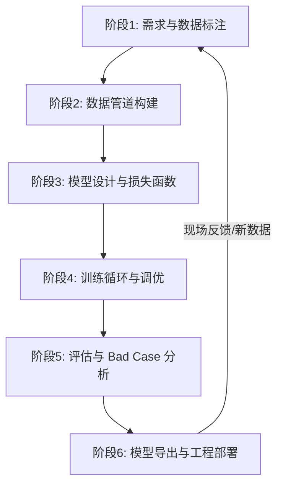

# 🚀 从零到一：搞定一个完整的计算机视觉（CV）项目

在实际的工业界和面试中，面试官不仅看你懂不懂算法，更看重你是否有**完整的项目工程闭环能力**。一个合格的 AI 工程师，必须清楚项目从“一句话需求”到“最终上线运行”的全部生命周期。

任何一个正常的、完整的 AI/CV 项目，都会经历以下 **6 大黄金阶段**。

---

## 🗺️ 完整项目全景图



---

## 📂 阶段一：需求定义与数据标注（Data is King 👑）

**“垃圾进，垃圾出 (Garbage in, Garbage out)”**。深度学习的本质是用数据给模型洗脑，数据的质量决定了模型的上限。

### 1. 明确任务与数据收集
* **定义目标**：我们要解决什么业务？（例如：安全帽违规检测、人脸打卡、缺陷检测）。
* **收集手段**：
  * **实地采集**：用工地的摄像头拍真实照片（最有效，符合真实应用场景）。
  * **网络爬虫**：从百度、Google 批量爬取相关图片。
  * **开源数据集**：Kaggle、Roboflow、COCO 数据集等。

### 2. 数据清洗
* 删掉模糊不清的图片、损坏打不开的图片。
* 删掉大量重复的图片（重复图片太多会导致模型“偏科”过拟合）。

### 3. 数据标注 (Labeling)
* **标注工具**：最常用的是 `labelImg`（标检测框）、`labelme`（标分割多边形）或网页版 `CVAT`。
* **数据格式**：
  * **YOLO 格式**：每一张图配一个 `.txt` 文件，里面记录 `[类别ID, 中心点X, 中心点Y, 宽度W, 高度H]`（值全部归一化到 0~1 之间）。
  * **VOC 格式**：输出 `.xml` 格式。
  * **COCO 格式**：把所有图片和框的信息写进一个巨大的 `.json` 文件里（大型比赛常用）。

---

## 📦 阶段二：数据管道构建（Data Pipeline 🧪）

数据标好后，我们不能直接一股脑喂给模型，需要给 PyTorch 搭建一条“传送带”。

### 1. 数据集划分
把所有图片和标注文件，按照比例随机划分为三部分：
* **训练集 (Train, 70% ~ 80%)**：给模型做练习题，调整参数。
* **验证集 (Val, 10% ~ 15%)**：期中考试。用来评估模型训练过程中的好坏，选择最好的权重。
* **测试集 (Test, 10% ~ 15%)**：期末闭卷考试。模型从未见过这部分数据，用来做最终成绩考核。

### 2. 手写 DataLoader（传送带）
在 PyTorch 中，我们需要写两个核心类：
* **`Dataset` 继承类**：告诉 PyTorch 怎么去文件夹里读取第 `i` 张图片，以及怎么找到它对应的标注标签（实现重写 `__len__` 和 `__getitem__` ）。
* **`DataLoader` 类**：负责多线程把图片打包成 Batch（比如一次打包 16 张图喂给模型），并打乱顺序（Shuffle）。

### 3. 数据增强 (Data Augmentation)
* **目的**：人工制造更多的数据，防止模型死记硬背（过拟合）。
* **常用手段**：
  * 随机翻转（左右镜像）、旋转、裁剪。
  * 改变亮度和对比度。
  * **Mosaic（马赛克增强）**：把 4 张不同的图拼成一张，能极大提升对小目标的检测能力。

---

## 🏗️ 阶段三：模型设计与损失函数（Model & Loss）

这部分是设计模型的“大脑”结构和“判卷标准”。

### 1. 骨干网络选择 (Backbone)
根据你的运行设备（手机端、边缘计算盒子、还是服务器）来选择网络结构：
* **轻量级（追求速度）**：MobileNet, ShuffleNet, YOLOn (Nano)。
* **重量级（追求精度）**：ResNet-50, ConvNeXt, Swin Transformer。

### 2. 损失函数设计 (Loss Function)
Loss 函数是模型的**“纠错老师”**。它算出的分值越高，说明模型预测越烂；分值越低，说明模型越准。
以 YOLO 目标检测为例，Loss 由三部分拼装而成：
* **分类 Loss (Class Loss)**：算模型有没有把“安全帽”认成“人头”。（常用交叉熵 CrossEntropy）。
* **定位 Loss (Box Loss)**：算模型画的红框准不准，和真实框差了多少厘米。（常用 CIoU/GIoU 损失）。
* **置信度 Loss (Objectness Loss)**：算模型有没有把背景（比如一盏灯）误判成有目标。

---

## 🏎️ 阶段四：模型训练与调优（Training Loop）

这是最烧显卡、最漫长的阶段，也是调参侠发挥实力的阶段。

### 1. 编写 PyTorch 训练循环 (Training Loop)
核心代码长这样（所有项目通用）：
```python
for epoch in range(epochs):
    for batch_images, batch_labels in dataloader:
        # 1. 前向传播：模型预测结果
        outputs = model(batch_images)
        # 2. 计算 Loss：算算考了多少分
        loss = criterion(outputs, batch_labels)
        # 3. 反向传播：计算每个参数要怎么修改（计算梯度）
        loss.backward()
        # 4. 优化器更新参数：迈出学习的一步
        optimizer.step()
        # 5. 梯度清零：清空黑板，准备下一轮计算
        optimizer.zero_grad()
```

### 2. 学习率策略与优化器调优
* **优化器选择**：对于新手，用 `AdamW` 比较省心；追求极致效果，通常用 `SGD`。
* **学习率衰减**：一上来步子迈得大一点（学习率高），后期快要接近最优解时，步子变小一点（学习率降低，使用余弦退火策略）。

### 3. 可视化监控
用 `TensorBoard` 或 `Weights & Biases (WandB)` 实时监控训练曲线：
* 如果**训练集 Loss 一直降，但验证集 Loss 不降反升**，说明**过拟合**了（模型死记硬背了训练集，没法泛化，需要多做数据增强或减小模型参数）。

---

## 📊 阶段五：评估与 Bad Case 分析（Evaluation）

训练完了，我们要拿着模型去测试集上做全面的体检。

### 1. 指标考核
* **Precision（精确率）**：模型说这里有 10 个安全帽，里面到底有几个是真正的安全帽？（防误报）
* **Recall（召回率）**：工地里明明有 10 个没戴安全帽的违规人员，模型抓到了几个？（防漏报）
* **mAP（平均精度均值）**：综合考核指标。

### 2. 坏例分析 (Bad Case Analysis) —— 面试核心亮点 🌟
训练完模型，90% 的人就觉得项目结束了。但**真正的工程师**会花几天时间去分析：**模型在哪些图片上翻车了？**
* 把测试集里模型**认错的图、漏掉的图**全部单独拎出来，分类总结原因：
  * 比如：发现漏检的全是**“晚上逆光”**的场景。
  * **解决手段**：回到阶段一，专门收集一批夜间逆光的照片进行标注，重新加入训练。这样迭代出来的模型，才是真正能落地的模型。

---

## 🚀 阶段六：模型导出与工程部署（Deployment）

模型训练好了，如何塞进工地的边缘计算摄像头里，让它实时跑起来？这就是我们最近在做的事。

### 1. 模型导出格式转换
直接用 PyTorch 的 `.pt` 格式跑太慢了，而且依赖很多 Python 库。我们需要将它导出为通用格式：
* **`.onnx`**：通用的“中间商”格式，几乎所有平台都支持。
* **`TensorRT (.engine)`**：英伟达显卡平台上的终极加速格式。
* **`TFLite` / `NCNN`**：部署在手机端或树莓派等嵌入式设备上的轻量格式。

### 2. 编写前/后处理代码
抛弃 PyTorch 库，用纯 C++ 或 Python 加上 ONNX Runtime 推理引擎：
* **前处理**：写好 `letterbox` 缩放，`RGB` 转换，维度转置 `CHW`，归一化。
* **后处理**：解析模型输出的坐标，手动应用 `NMS`（非极大值抑制）去重。

### 3. 业务逻辑落地（让项目“牛逼”起来的细节）
* **防抖/去重机制**：加入**冷却时间（Cooldown）**或**目标追踪（ByteTrack）**，防止硬盘被重复截图塞爆。
* **对接系统接口**：当触发违规报警时，自动把截图上传至云服务器，并向工地的安全管理员发送短信或企业微信警报。

---

## 💡 面试加分总结：怎么跟面试官吹嘘你的项目经验？

如果面试官问：“**请讲讲你之前做的这个安全帽检测项目。**”
* **别只说**：“我用 YOLOv8 在数据集上跑了 100 个 Epoch，精度到了 92%。”（这是学生水平，听起来像在交作业）。
* **你应该说**：
  > “我们在做这个项目时，核心经历了三个迭代。
  > 
  > 首先是**数据清洗和防抖阶段**，因为现场摄像头视角有逆光，且工人在摄像头前站立时会产生大量重复报警，我们设计了 **ByteTrack 目标追踪结合报警冷却机制（Cooldown）**，将报警冗余降低了 85%，保护了业主服务器的硬盘存储。
  > 
  > 其次是**性能优化阶段**，为了在边缘端低功耗设备上流畅运行，我们把 PyTorch 导出了 **ONNX 格式**，用 ONNX Runtime 编写了高效的前后处理，并通过**隔帧推理（跳帧复用旧框）**策略，在设备上实现了 30+ FPS 的流畅度。
  > 
  > 最后我们通过 **Bad Case 分析**，发现模型对夜间黄色安全帽存在误判，后期定向补充了 12% 的暗光数据，使得最终的召回率提升到了 95% 以上，完成了闭环落地。”
