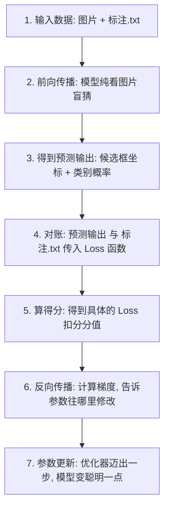

# 🧠 模型的无知与启蒙：它是如何从零学会新物体的

许多初学者会有一个困惑：**“模型最开始是‘无知’的，既然它是盲猜，它以前又没见过安全帽，那它怎么可能知道答案是安全帽呢？”**

本笔记通过最直观的逻辑，为你系统性、高效率地讲清**“为什么模型能学会它没见过的东西”**以及**“训练流程的每一步细节”**。

---

## 🔍 第一部分：没见过的东西，模型为什么能对上答案？

**核心真相：模型自己永远不会“知道”什么是安全帽。是人类通过标注文件（.txt）强行“规训”了它。**

我们用一个大白话的步骤来还原这个过程：

1. **初始的无知**：
   * 刚开始训练时，模型是个瞎子。你给它一张“安全帽”的图，它脑子里的参数是随机的，它胡乱指了一个地方，猜它的概率是：`是狗的概率 90%，是猫的概率 10%`。
2. **人类标准答案的强行介入**：
   * 虽然模型猜了是狗，但此时**考官（Loss 函数）**拿出了人类事先标好的 `.txt` 答案（标签）。
   * 这个标签里白纸黑字写着：**“这个位置，类别是 0（0 代表安全帽，概率是 100%）”**。
3. **强行惩罚与规训**：
   * 考官对比发现：模型猜是狗，但正确答案是 0。
   * 考官直接算出巨大的 **Loss（惩罚分）**，并通过反向传播狠狠敲打模型的参数：“猜狗是错的！这里是类别 0！立刻改你的参数！”
4. **反射弧的建立**：
   * 模型挨揍后，微调了参数。
   * 经过成千上万次“看图 ➡️ 猜错 ➡️ 被拿标签修正 ➡️ 改参数”的循环，模型脑子里的参数最终形成了一条稳固的**条件反射映射**：
     > **“只要图片里出现‘圆形、塑料光泽、戴在人头上’的特征，我就输出类别 0（即我们口中的安全帽）。”**

**总结**：模型根本不需要提前见过它。它只是像巴甫洛夫养狗一样，在**图片特征**与**人类强制给出的标签**之间，通过挨揍（算 Loss）建立了一条条件反射通道。

---

## ⚙️ 第二部分：YOLO 训练的完整流程细节（到底是怎么跑的）

以下是模型每训练一个 batch（批次）的严密物理流程：



### 📋 详细文字流拆解：

#### 🚀 第一步：数据输入
* 读入一批图片（如 16 张图）以及它们对应的标签文本（`.txt`，记录着每个安全帽的类别 `0` 和它的四维坐标）。

#### 🚀 第二步：前向传播（Forward Pass）—— 盲做题目
* 16 张图片的像素矩阵流入 YOLO 的网络结构（卷积层等）。
* **防作弊**：标签 `.txt` 被锁在抽屉里，不参与这个计算。
* 模型经过复杂的矩阵相乘，最终输出一个**预测张量（Tensor）**，里面包含模型自己画的框的坐标，以及它认为的类别概率。

#### 🚀 第三步：对答案（Loss Computation）—— 考官批改
* 考官把**预测张量**和抽屉里的**标签 `.txt`** 拿过来，放进损失函数公式。
* 分别计算：
  1. **定位误差（Box Loss）**：模型框的位置画歪了多少？
  2. **类别误差（Cls Loss）**：模型把安全帽认错成别的了多少？
* 两个误差相加，得到最终的 **Loss（总扣分）**。

#### 🚀 第四步：反向传播（Backward Pass）—— 惩罚回传
* PyTorch 自动启动反向传播，从 Loss 开始，沿着网络结构倒着计算偏导数，算出来的就是 **梯度（Gradient）**。
* **物理意义**：梯度就像是“指南针”，它指明了每一个权重参数如果想要降低 Loss，应该往大调还是往小调。

#### 🚀 第五步：参数更新（Optimizer Step）—— 修正大脑
* 优化器（如 AdamW）根据刚刚算出来的梯度，执行：
  $$\text{新参数} = \text{旧参数} - \text{学习率} \times \text{梯度}$$
* 这一步完成，模型内部的参数就被正式修改了。模型比一秒钟前变聪明了一点点。

#### 🚀 第六步：下一轮循环 / 期末考试
* 重复上述五步，直到所有训练图片都学了一遍（这叫一个 **Epoch**）。
* Epoch 结束时，把模型拉进 `val` 验证集考场，进行闭卷考试，打出 mAP 成绩。

---

## 🔨 第三部分：用代码逐行对照每一步

上面是文字描述，下面用你手写的 PyTorch 训练循环逐行对应：

```python
# ==== 配置（训练前准备好）====
model = SimpleCNN().to(device)           # 模型：参数全是随机的（无知状态）
criterion = nn.CrossEntropyLoss()        # 考官：负责打分（Loss 函数）
optimizer = torch.optim.Adam(model.parameters(), lr=0.001)  # 教鞭（优化器）

for epoch in range(epochs):              # ← 第六步：一轮一轮循环
    model.train()
    for images, labels in trainloader:   # ← 第一步：读一批图片 + 标签

        # ── 第二步：前向传播（盲猜）──
        output = model(images)           # 模型只看图片像素，不看标签
        # output 形状: [batch, 10] ← 每张图 10 个分数（初始全是随机瞎猜）

        # ── 第三步：对答案（算 Loss）──
        loss = criterion(output, labels) # 考官：把盲猜结果和标签对比
        # 初始 loss ≈ 2.3（很高，因为全是瞎猜）

        # ── 第四步：反向传播（算梯度）──
        optimizer.zero_grad()            # 清空上一批累积的梯度
        loss.backward()                  # 自动沿着计算图倒着算梯度
        # 此时 model.linear.weight.grad = [-0.08, 0.12, ...]
        # 含义："这个 weight 往负方向调，loss 会变小"

        # ── 第五步：参数更新（学聪明一点）──
        optimizer.step()                 # weight = weight - lr × grad
        # 参数被修改了！这批数据把模型往"正确答案"方向推了一小步

# 一个 batch 完成 → 下一个 batch → 所有 batch 过完 = 1 个 epoch
```

### 用具体数字看一次更新过程

假设你训练 CNN 分类 CIFAR-10，batch_size=64：

```
Epoch 0, Batch 0（模型完全随机）：

一张猫图经过模型 →
  output = [0.1, 0.3, -0.2, 0.5, 0.1, -0.1, 0.0, 0.2, 0.4, -0.3]
  #       猫   飞机   鸟   狗   ...
  label  = 3（正确答案：狗）
  
  → softmax 算概率 → 狗的概率 = 21%  ← 随机猜结果
  → CrossEntropyLoss = -ln(0.21) = 1.56  ← 扣分

loss.backward() 算出梯度：
  "把 output[3]（狗的分数）调高 0.79"
  "把 output[0,1,2,4,5,6,7,8,9]（其他类）各调低 0.02"

optimizer.step() 后：
  模型参数被微调 → 同一张图再跑 → output[3] 从 0.5 变成 0.62
  → 狗的概率从 21% → 26%  ← 进步了 5%

────────────────────────────

Epoch 0, Batch 100（100 批之后）：
  同一张猫图 →
  output[3] = 8.5  ← 狗的分数很高
  → 狗的概率 = 92%  ← 学会了！
```

### 为什么不是一步到位

```python
# 假设一步把参数调到位 → lr 设 100
loss.backward()
optimizer.step()  # weight 直接跳飞了 → 刚从"猜猫"变成"猜狗"
# 下一批图进来全是狗 → 模型全猜狗 → loss 又巨大
# → 又跳回全猜猫 → 震荡 → 永远学不会

# 所以 lr 必须小：
lr = 0.001  # 每次只动一点点 → 方向对了就慢慢收敛到正确位置
```

### 和 YOLO 训练的关系

YOLO 训练和你的 CNN 分类**完全一样的过程**，只是：
- YOLO 的模型更复杂（几十层 vs 你的 2 层）
- YOLO 的输出更多（8400 个位置 × 每位置若干框 vs 你的 10 个分数）
- YOLO 的 loss 拆成 3 份（box/cls/dfl vs 你的 1 个 CrossEntropyLoss）

**但核心循环一模一样：前向 → loss → backward → step，重复几千次。**
