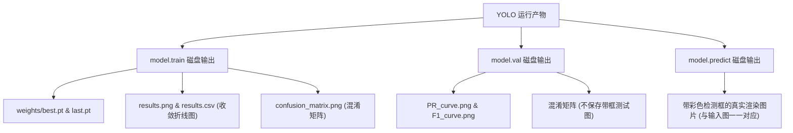

# 17_YOLO三板斧API底层原理解密：Train, Val, Predict的物理产物与内存返回值

在实际算法开发和面试中，只会在命令行里敲 `yolo task=detect` 是完全不够的。面试官非常看重你是否理解 **YOLO 底层的 API 调用逻辑、各函数的内存返回值、以及数据后处理（Post-processing）代码的编写能力**。

本篇笔记将带你彻底拆解 YOLO 官方 Python API 的三板斧：`train()`、`val()` 和 `predict()`。

---

## 📂 第一部分：三大API运行后的「物理产物」（runs/ 目录下到底生成了什么）

当我们在代码中运行这三个 API 时，YOLO 会在指定的磁盘目录（`project/name/`）中吐出一堆物理文件。



### 1. `model.train()` 的磁盘物理产物

这是内容最丰富的目录，主要用于记录训练过程和保存模型：

*   **`weights/best.pt`（最优权重）**：
    *   在所有 Epoch 中，在验证集上取得**综合成绩最高（mAP50 最高）**的那一轮的参数备份。我们后续推理部署只用它。
*   **`weights/last.pt`（最终/断点权重）**：
    *   最后一轮训练结束时的参数备份。主要用于**断点续训（Resume）**，加载它并传入 `resume=True` 就可以让模型接着往下训，不浪费已训练轮数。
*   **`results.png`（训练收敛折线图）** —— **面试超高频提问点**：
    *   记录了每一轮的 `train/box_loss`（定位损耗）、`train/cls_loss`（分类损耗）以及验证集上对应的 Loss 和 mAP 指标。
    *   *💡 面试官：“你怎么通过这个图判断模型是否过拟合（Overfitting）？”*
    *   *答：“如果 `train/loss` 曲线一直在稳步下降，但 `val/loss` 曲线在某轮之后不降反升，说明模型在训练集上死记硬背了，泛化能力变差，发生了过拟合。此时需要提前停止训练（Early Stopping）。”*
*   **`confusion_matrix.png`（混淆矩阵）**：
    *   横轴是模型预测的类别，纵轴是真正的真实类别。对角线（左上到右下）颜色越深，说明分类越精准。如果背景列数值高，说明模型经常把背景杂物错认成目标（误检），或把目标漏掉（漏检）。
*   **`args.yaml`（参数备份）**：
    *   备份了本次训练踩下的所有超参数（如 `lr0=0.01`、`imgsz=640` 等），方便以后查对实验版本。
*   **`train_batch0.jpg` 等（数据增强可视化）**：
    *   展示了第一批训练集图片在被喂入网络前，YOLO 自动进行的 Mosaic（马赛克拼接）等图像增强手段。

### 2. `model.val()` 的磁盘物理产物

`val` 类似于“期末闭卷考试”，它只关注模型的学术成绩：

*   **学术图表**：会在硬盘中生成 `PR_curve.png`（精准率-召回率曲线）、`confusion_matrix.png` 等评估表。
*   **⚠️ 核心注意点**：`val` 运行时**绝对不会保存任何画了彩色矩形框的测试结果图片**。因为它是纯学术考试，只管打分（计算精度），不管画图。

### 3. `model.predict()` 的磁盘物理产物

`predict` 则是“实战演练”，它不管分数，只管找出目标并画图：

*   **带框结果图片（如 `*.jpg`）**：
    *   在磁盘上保存画有彩色 Bounding Box（检测矩形框）、类别名称和 Confidence Score（置信度分数）的图片。
*   **一一对应关系**：如果你喂进去了 48 张未知图片，它就必定会生成 48 张结果图。**哪怕某张图片上模型一个框都没画出来，它也依然会拷贝生成一张干净的图片放在输出目录里**。

---

## 💻 第二部分：三大API在内存中的返回值、用法与属性

做深度学习应用开发时，我们需要在 Python 代码中拿到模型预测出的具体数据（如框坐标、置信度、考试分数）来写业务逻辑。这就必须掌握它们在代码内存中的返回值对象。

### 1. `model.train()` 的内存返回值
*   **返回值类型**：`DetMetrics` 对象（在老版本中甚至直接返回 `None`）。
*   **用法**：在工业界**极少被接收**。因为训练需要几小时甚至几天，我们只想要它在硬盘里生成的 `best.pt` 权重文件，代码里直接写 `model.train(...)` 即可。

---

### 2. `model.val()` 的内存返回值 —— `DetMetrics` 成绩单

*   **返回值类型**：一个评估指标对象（通常我们命名为 `metrics`）。
*   **内存常用核心属性**：
    *   `metrics.box.map50`：综合 mAP50 分数（目标检测领域的黄金总分，0.0 ~ 1.0）。
    *   `metrics.box.mp`：全网所有类别平均 Precision（精准率）。
    *   `metrics.box.mr`：全网所有类别平均 Recall（召回率）。
    *   `metrics.box.p`、`metrics.box.r`、`metrics.box.ap50`：每个类别各自对应的精准率、召回率、AP50 数组。

#### 💻 面试后处理实战：如何用代码把分类别的成绩打印出来？
在 `03_val.py` 中，我们就是用以下代码把内存里的 `metrics` 转换成漂亮的控制台表格的：
```python
# 遍历评估返回的类别索引，从 indices 映射回具体的英文类别名
for i, class_id in enumerate(metrics.box.ap_class_index):
    name = metrics.names[int(class_id)]  # 查字典拿到类别名字，如 'helmet'
    p = metrics.box.p[i]                 # 该类别的 Precision
    r = metrics.box.r[i]                 # 该类别的 Recall
    ap50 = metrics.box.ap50[i]           # 该类别的 AP50
    print(f"类别: {name} | 准确率 P: {p:.3f} | 召回率 R: {r:.3f} | mAP50: {ap50:.3f}")
```
*   *💡 面试官：“读取内存里的 metrics 有什么用？”*
    *   *答：“在做自动调参（AutoML）或者超参数搜索时，我们通过代码读取 `metrics.box.map50` 分数，可以用脚本自动筛选出性能最好的超参数组合，无需人工去盯着磁盘上的图表。”*

---

### 3. `model.predict()` 的内存返回值 —— `List[Results]` 检测框定位器

*   **返回值类型**：一个 `Results` 对象的列表（`List[Results]`）。列表的长度与输入的图片张数完全一致。

#### 🔍 `Results` 对象的内部核心数据结构（非常高频的面试代码考点）：
当你用 `results = model.predict(source)` 拿到列表，并取出第一张图的结果 `result = results[0]` 后，它有以下内存属性：

1.  **`result.boxes` (检测框包)** —— 包含了检测到的所有矩形框：
    *   **`result.boxes.xyxy`**：一个 PyTorch Tensor 矩阵。保存所有检测框的左上角和右下角像素坐标：`[[x1, y1, x2, y2], [x1, y1, x2, y2], ...]`。
    *   **`result.boxes.xywh`**：保存框的中心坐标和宽高：`[[x_center, y_center, w, h], ...]`。通常在进行多目标追踪（如 ByteTrack）时做位置预测用。
    *   **`result.boxes.conf`**：置信度分数 Tensor：`[0.95, 0.82, ...]`。
    *   **`result.boxes.cls`**：类别 ID 的 Tensor 列表：`[0.0, 2.0, ...]`（`0.0` 代表类别 0，`2.0` 代表类别 2）。
2.  **`result.names` (类别映射表)**：
    *   数据集类别字典，如 `{0: 'helmet', 1: 'no-helmet', 2: 'safety-vest'}`。
3.  **`result.orig_img` (原始图片)**：
    *   OpenCV 格式的 numpy 图片矩阵，供你在代码中自己调用 `cv2.rectangle` 手动在上面定制化画框或截取图像。

#### 💻 面试后处理实战：如何编写一个“未戴安全帽报警系统”的后处理代码？
面试官最喜欢让你现场手写后处理。你可以用以下代码直接展示你的底层调用功底：
```python
# 假设我们传入单张摄像头图片进行 predict
results = model.predict(source="camera.jpg", conf=0.25)
result = results[0]

# 遍历检测出来的每一个框
for box in result.boxes:
    class_id = int(box.cls[0].item())  # 拿到类别 ID，如 1
    class_name = result.names[class_id]  # 映射出名字，如 'no-helmet'
    score = box.conf[0].item()         # 拿到置信度分数
    
    # 业务逻辑：如果发现有人没戴安全帽，且置信度大于 80%
    if class_name == "no-helmet" and score > 0.80:
        # 拿到框的左上角和右下角像素坐标，方便截图报警
        x1, y1, x2, y2 = box.xyxy[0].tolist()
        print(f"🚨 警告！检测到人员未戴安全帽！坐标: ({x1:.1f}, {y1:.1f}), 置信度: {score:.2%}")
        # 这里可以调用你的硬件蜂鸣器报警，或者发邮件通知安全员
```

---

## 🆚 总结：`model.val()` 与 `model.predict()` 的本质区别

| 维度 | `model.val()` (考卷批改) | `model.predict()` (实战找目标) |
| :--- | :--- | :--- |
| **核心目的** | 在验证集上打分，计算 mAP50、Precision 等学术指标。 | 在未知输入上，精确定位出所有目标的位置和类别。 |
| **是否需要标准答案** | **必须需要**（要和标签 `.txt` 对答案）。 | **绝对不需要**（纯未知数据，摄像头实时抓取）。 |
| **磁盘物理产物** | 学术指标图表（PR 曲线、混淆矩阵）。无画框图片。 | 仅输出画好彩色检测框的结果渲染图片。 |
| **内存返回值** | `DetMetrics` 对象（装满各种考试分数）。 | `List[Results]`（装满检测框的 `xyxy` 坐标、`conf` 等）。 |
| **典型面试应用** | “怎么根据指标调参、判断过拟合、分析精度瓶颈。” | “怎么编写定制化业务后处理，实现摄像头抓拍报警。” |
