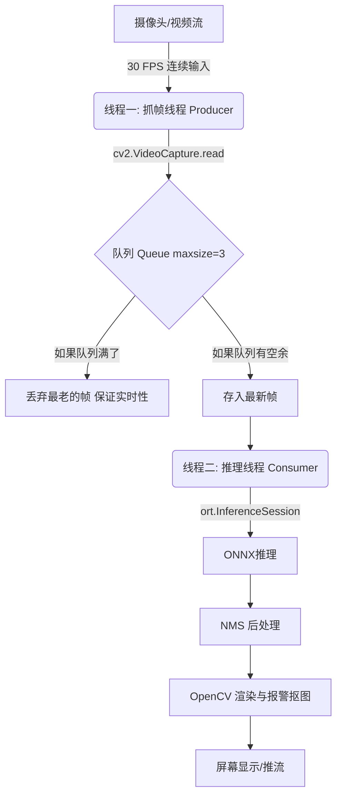

# 23_纯 ONNX 视频侦测系统架构设计

当我们从“单张图片检测”跨越到“视频/摄像头实时检测”时，面临的挑战完全不同。如果只是简单地写一个 `while True` 循环去读帧并推理，程序很快就会卡死、掉帧或延迟越来越高。

这篇笔记就来详解一下，一个**工业级的纯 ONNX 视频检测系统到底应该怎么组建**。

---

## 🛑 一、 痛点分析：为什么直接套 `while True` 循环不行？

很多新手写的视频检测伪代码是这样的：
```python
cap = cv2.VideoCapture("video.mp4")
while cap.isOpened():
    ret, frame = cap.read() # 1. 读帧（约 10ms ~ 30ms）
    results = onnx_infer(frame) # 2. 模型推理（约 50ms ~ 150ms）
    cv2.imshow("show", frame) # 3. 渲染显示（约 5ms）
```
这种单线程循环在实际运行中，会遇到以下三个致命问题：

1.  **木桶效应（互相拖后腿）**：
    由于读帧、推理、渲染都在同一个线程。如果 ONNX 推理在你的 CPU 上需要 100ms，那么这 100ms 期间，OpenCV 是没法读下一帧的。最终你的视频播放帧率会被强行限制在 $1000 / (10 + 100 + 5) \approx 8.7$ 帧。播放起来就像放 PPT 一样卡。
2.  **延迟累积（越看越卡）**：
    如果摄像头源源不断以 30 FPS（每 33ms 一帧）的速度把画面推送过来，而你的模型 100ms 才能处理完一帧。那么很快，系统底层的缓冲区就会堆积大量没处理的旧画面。你会发现监控画面里的人**慢动作播放**，延迟从 1 秒累积到 10 秒，最后内存暴涨直接崩溃。
3.  **无法展示真实的 FPS**：
    单线程下，你算出来的 FPS 实际上是“被模型卡死后的帧率”，没法反映出硬件真正的推理上限。

---

## 🛠️ 二、 系统如何组建？（两套架构方案）

针对上述痛点，工业界通常有两套系统组建方案。

### 方案 1：极简单线程 + 跳帧机制（快速实现首选）

如果我们想用最少的代码实现快速学习，可以在单线程里加入**跳帧（Skip Frame）**和**直接丢包**逻辑：

```
[视频源] ➡️ (读取第 N 帧) ➡️ [是否满足跳帧条件？]
                                  ⬇️
                         [是: 跳过推理] ➡️ [直接用旧框或不画框渲染]
                                  ⬇️
                         [否: ONNX推理] ➡️ [更新目标框] ➡️ [渲染显示]
```

*   **优点**：代码简单，不需要处理多线程并发的死锁、线程安全问题。
*   **优化技巧**：
    *   通过 `cv2.getTickCount()` 或者是 `time.time()` 精准计算每一步耗时。
    *   **隔帧推理**：比如设置 `skip_count = 3`。第 1 帧送去 ONNX 推理，第 2、3 帧不推理（直接复用第 1 帧画好的框），第 4 帧再推理。这样能在损失极小精度的情况下，把流畅度瞬间提升 3 倍。

---

### 方案 2：双线程“生产者-消费者”架构（工业级，含金量所在）

为了彻底解决卡顿和延迟累积，我们可以使用 **双线程 + 线程安全队列（Queue）** 的架构。



#### 1. 抓帧线程（生产者 - Producer）
*   **任务**：只负责一件事情，疯狂调用 `cap.read()` 抓取图像。
*   **策略**：读取到图像后，直接扔进一个共享的 `Queue` 里面。

#### 2. 共享队列（Queue）
*   **关键设置**：队列的容量不能是无限的，通常设置为 `maxsize=3` 或 `maxsize=1`。
*   **丢帧逻辑**：当队列满了，如果来了新帧，**立刻把最老的一帧从队列里丢弃**，然后存入最新的帧。这叫“只消费最新鲜的数据”，彻底消除了延迟累积。

#### 3. 推理渲染线程（消费者 - Consumer）
*   **任务**：只负责从队列里取图，送入 ONNX 运行前向传播，接着用 OpenCV 画框并输出。
*   **优点**：即使推理需要 200ms，也完全不耽误抓帧线程以 30 FPS 的速度继续缓存最新的画面。

---

## 📊 三、 核心代码块的设计细节

要写好视频侦测，以下几个代码模块的组装非常关键：

### 1. FPS 实时计算器
计算 FPS 绝对不能简单地用 `1 / (当前帧推理时间)`，这样算出来的 FPS 会闪烁得很厉害，极不专业。
**正确做法**：使用**时间窗口平滑算法**（累加 10 帧的时间，求平均值）：
```python
import time

class FPSCalculator:
    def __init__(self):
        self.prev_time = time.time()
        self.fps = 0.0
        self.frame_count = 0
        self.start_time = time.time()

    def update(self):
        self.frame_count += 1
        curr_time = time.time()
        # 每过 1 秒更新一次平均 FPS，防止画面上的数字狂闪
        elapsed = curr_time - self.start_time
        if elapsed >= 1.0:
            self.fps = self.frame_count / elapsed
            self.frame_count = 0
            self.start_time = curr_time
        return self.fps
```

### 2. OpenCV 的资源优雅释放与按键交互
在视频检测中，我们常用 `cv2.waitKey(1)` 来检测用户按键：
*   **千万不能漏掉释放**：当用户按 `q` 退出或者视频播放完毕时，必须调用 `cap.release()` 和 `cv2.destroyAllWindows()`，否则 Python 进程可能会因为资源未释放而死锁卡住。

---

## 🎯 四、 方案 2 的完整可跑代码（双线程生产者-消费者）

```python
import cv2, time, queue, threading, onnxruntime as ort, numpy as np

# ── 预处理（和训练时完全对齐）──
def preprocess(frame):
    img = cv2.resize(frame, (640, 640))
    img = cv2.cvtColor(img, cv2.COLOR_BGR2RGB).astype(np.float32) / 255.0
    return np.transpose(img, (2, 0, 1))[np.newaxis, ...]

# ── FPS 平滑计算器 ──
class FPSCounter:
    def __init__(self):
        self.count = 0; self.start = time.time()
    def update(self):
        self.count += 1
        elapsed = time.time() - self.start
        if elapsed >= 1.0:
            fps = self.count / elapsed
            self.count = 0; self.start = time.time()
            return fps
        return None

# ── 线程 1: 抓帧 ──
class FrameGrabber(threading.Thread):
    def __init__(self, source, frame_queue, maxsize=3):
        super().__init__()
        self.cap = cv2.VideoCapture(source)
        self.q = frame_queue
        self.running = True
    def run(self):
        while self.running:
            ret, frame = self.cap.read()
            if not ret: break
            if self.q.full():
                self.q.get()        # 丢最老帧 → 保证实时性
            self.q.put(frame)
        self.cap.release()
    def stop(self):
        self.running = False

# ── 线程 2: 推理 + 显示 ──
class InferenceWorker(threading.Thread):
    def __init__(self, frame_queue, onnx_path):
        super().__init__()
        self.q = frame_queue
        self.session = ort.InferenceSession(onnx_path,
            providers=['CUDAExecutionProvider', 'CPUExecutionProvider'])
        self.running = True
    def run(self):
        fps = FPSCounter()
        while self.running:
            try:
                frame = self.q.get(timeout=1)
            except queue.Empty:
                continue
            # 推理
            tensor = preprocess(frame)
            outputs = self.session.run(None, {“images”: tensor})
            # (这里加你的后处理/NMS/画框代码)

            f = fps.update()
            if f:
                print(f”FPS: {f:.1f}”, end=”\r”)
            cv2.imshow(“Video”, frame)
            if cv2.waitKey(1) & 0xFF == ord('q'):
                break
        cv2.destroyAllWindows()
    def stop(self):
        self.running = False

# ── 启动 ──
if __name__ == “__main__”:
    q = queue.Queue(maxsize=3)
    grabber = FrameGrabber(“video.mp4”, q)
    worker = InferenceWorker(q, “best.onnx”)

    grabber.start(); worker.start()
    worker.join(); grabber.stop(); grabber.join()
```

**单线程 vs 双线程对比：**
| | 单线程 | 双线程 |
|---|---|---|
| 读帧阻塞推理？ | 是（互相等） | 否（并行） |
| 延迟累积 | 有 | 无（丢最老帧） |
| 代码复杂度 | 10 行 | 50 行 |
| 适合 | 本地演示 | 生产环境 |
